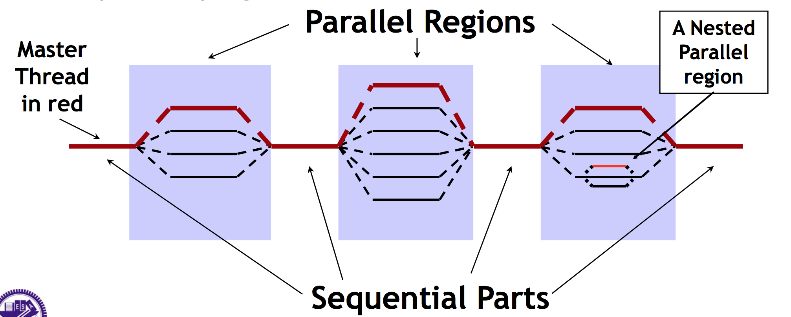
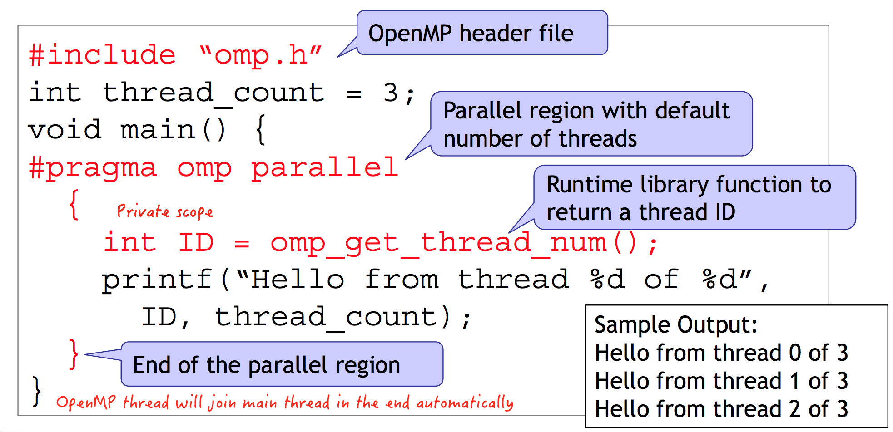
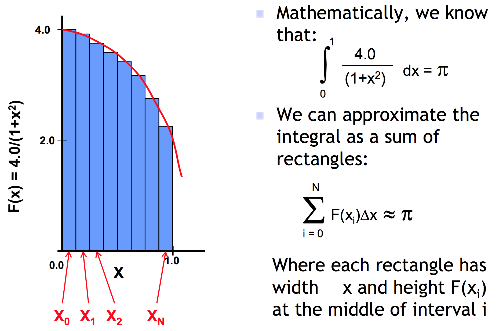
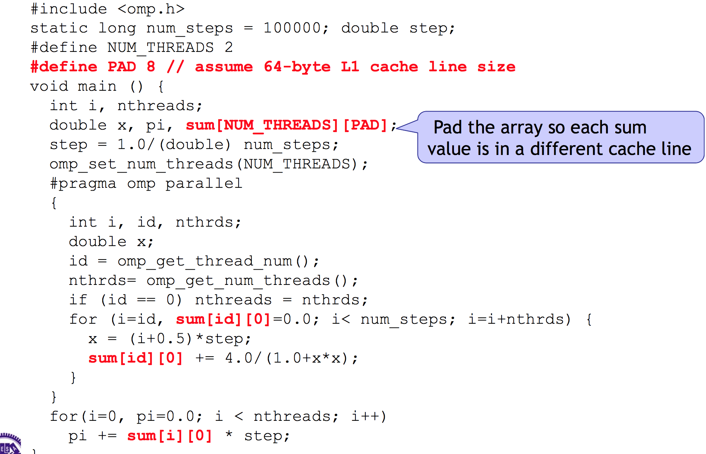

# OpenMP

## Contents
* [Introduction](#intro)
* [Hello World in OpenMP](#hwop)
* OpenMP - Calculate Pi
    - [Base implement](#pibase)
    - [False sharing problem](#fsp)
    - [Without fasle sharing version](#wfsv)

## Introduction <a name="intro"></a>
* Open specification for Multi-Processor
* __Standard__ API for defining __multi-threaded shared-memory__ programs
* High Level API (相較於pthread)
    - Preprocessor directives (80%)
        - creating teams of threads
        - sharing work among threads
        - sync. the threads
    - Library Calls (19%)
        - setting and querying thread's attributes
    - Environment variables (1%)
        - controlling run-time behavior of the parallel program
* Fork-Join Parallelism
    - Master thread spawns a team of threads as needed
    - Parallelism added incrementally until performance are met
    

## Hello World in OpenMP <a name="hwop"></a>

* Compile
``` Shell
$ gcc -fopenmp -o main main.c
```

## OpenMP - Calculate Pi 

### Base implement by OpenMP <a name="pibase"></a>
``` C
#include <omp.h>

#define NUM_THREADS 2

static long num_steps = 100000;
double step;

void main() {
    int i, nthreads;
    double x, pi, sum[NUM_THREADS];
    step = 1.0 / (double) num_steps;
    omp_set_num_threads(NUM_THREADS);

    #pragma omp parallel 
    {
        int i, id, nthrds;
        double x;
        id = omp_get_thread_num();
        // 有時候, OpenMP建立的thread數目會跟我們設定的不一樣(效能考量)
        nthrds = omp_get_num_threads(); // 取出真正的threads數目
        if(id == 0) nthreads = nthrds;  // 去更改, 只有在thread id是0時才動, 也就是動一次

        // 用「id」(0~n-1)來作為依據, 剛好可以用來進行資料的分配
        for(i=id, sum[id]=0.0; i < num_steps; i=i+nthrds) {
            x = (i+0.5)*step;
            sum[id] += 4.0/(1.0 + x*x);
        }
    }

    for(i=0, pi=0.0; i < nthreads; i++) {
        pi += sum[i] * step;
    }
}
```
* Has __false sharing__ problem
    - 導致當CPU數量提升平行化時, 卻沒有提升效率

### False sharing problem <a name="fsp"></a>
* Cache consistent in Multi-processor
    - 當有多顆CPU各自有Cache時, 會有硬體提供的Cache consistent protocol
        - 假設有兩個CPU存取了同一塊Memory中的data, data會被分別cache在他們的cache中, 假設有一方對該資料進行寫入, 此時會invalidate另一顆CPU中含這筆資料的cache line
        - 當另一顆CPU要再次存取此資料, 需要再去memory抓一次
* False sharing
    - 當一筆連續型資料(e.g. array), 同時被快取在多顆CPU上的cache, 且在各個cache中都是被快取在同一個cache line上, 假設CPU_A只關心這連續資料中的某一個元素, 而CPU_B對這個連續資料中的另一個元素進行寫入, 此時在CPU_A中的cache line依然會被invalid！
    - 各CPU所關心的資料是不同的, 但是因為是連續資料, 一次性的invalid整個cache line, 導致 __Fasle__ sharing

### Without fasle sharing version <a name="wfsv"></a>
