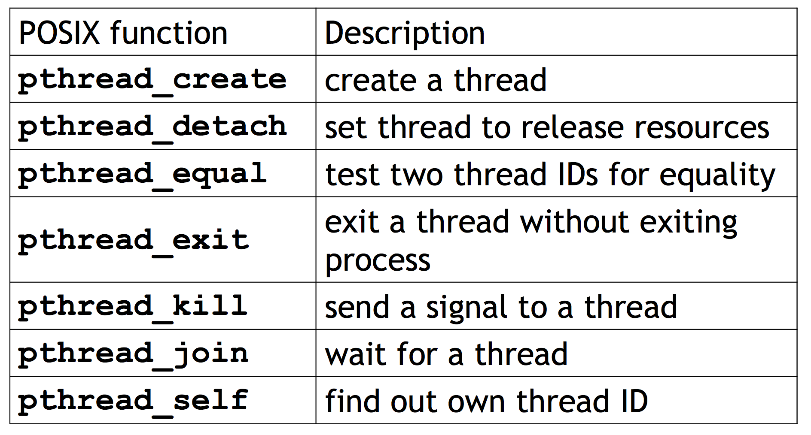
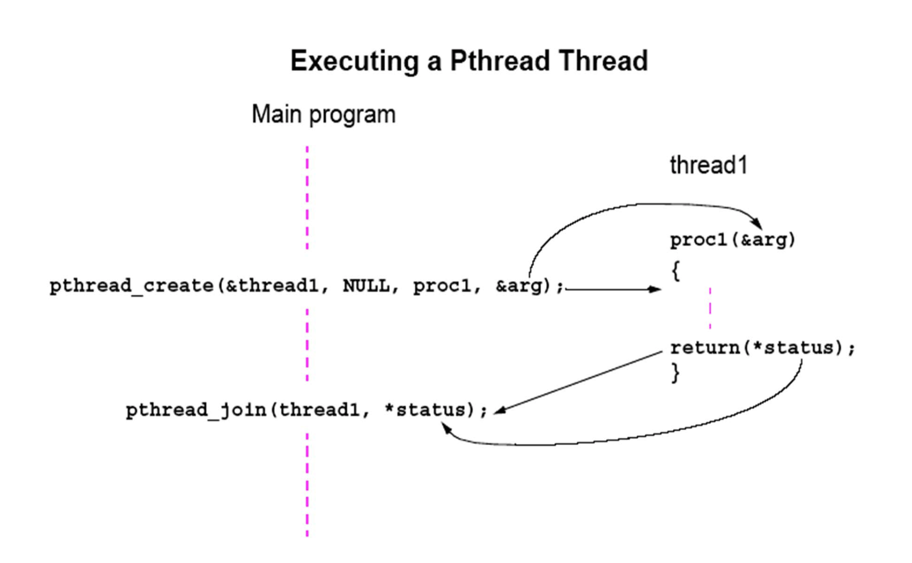
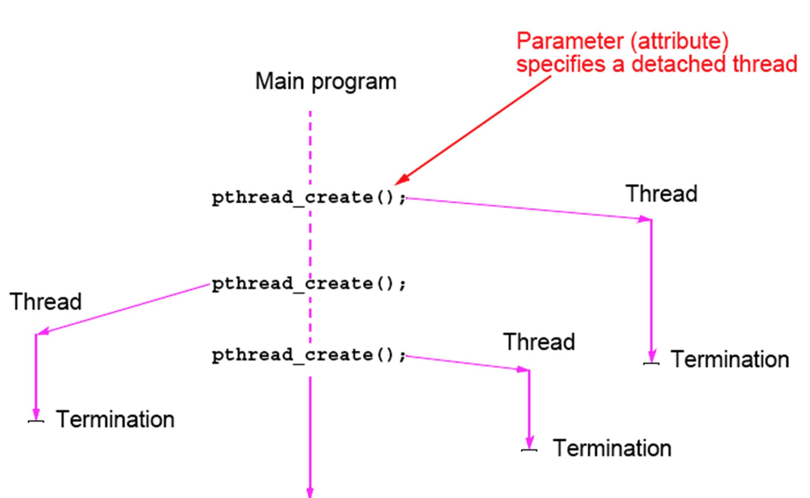

# Pthread

## Contents
* [Introduction](#i)
* [Pthread operations in C/C++](#opc)
* [Creation of thread](#cot)
* [Waiting for thread complete](#wftc)
* [Ternimation of threads](#tot)
* [Detached thread](#dt)
* [A pthread Hello world Example](#exm)
* [Mutex in pthread](#mutex)
* [Semaphores in C library](#sem)
* [Barriers](#bar)
* [Conditiob in pthread](#cond)
* [Read/Write lock in pthread](#rwlock)

## Introduction <a name="i"></a>
* POSIX threading interface
* Is an 'interface', how it's implemented depends on the platform
    - e.g. Linux uses kernel threads; Windows uses Win32 threads ... etc.
* Threads scheduling done by OS 
* Specifies a __library__ that can link to C/C++ programs 
    - In C++, recommend using std:thread instead of pthread library 

## Pthread operations in C/C++ <a name="opc"></a>


## Creation of thread <a name="cot"></a>
### pthread_create(...)
```  C
int pthread_create(
    pthread_t*  thread_p,               /* out */
    const pthread_attr_r* attr_p,       /* in  */
    void*   (*start_routine)(void*),    /* in  */
    void*   arg_p                       /* in  */
);
```
* Param 1 : thread_p
    - Pointer to __pthread_t__ object
        - must be allocated before the create call
            - 需事先建立好這個Object的空間
        - Call 完 create, 會把相關資訊存進這個Object
* Param 2 : attr_p
    - Pointer to __pthread_attr_t__ object
        - 可以用這個Object來定義一些thread的屬性
        - 通常成 __NULL__ 即可, 也就是使用default的thread屬性
* Param 3 : start_routine
    - Pointer to a function
        - 該thread要執行的task function 
* Param 4 : arg_p   
    - Pointer to Argument
        - 要傳進該task function的參數

## Waiting for thread complete <a name="wftc"></a>
### pthread_join(...)
``` C
int pthread_join(
    pthread_t thread,   /* in  */
    void** ret_val_p    /* out */
);
```
* Param 1 : thread
    - Wait for thread associtated with pthread_t object to complete
* Param 2 : ret_val_p
    - Receive any return value computed by the thread



## Ternimation of threads <a name="tot"></a>
### Implicit 
* Return from thread's task function
    - function's return value will be return back to the parent 
## Explicit
* pthread_exit(status)
    - calling it in thread task function
    - argument __status__ will be return value to the parent
* pthread_cancel(pthread_t tid)
    - Terminating a thread __from another__ thread

## Detached thread <a name="dt"></a>
* Threads not joined are call detached thread
* Setting a thread to detached thread using thread attribute object 
* When terminate, thier resources will release


## A pthread Hello world Example <a name="exm"></a>
``` C
#include <stdio.h>
#include <stdlib.h>
#include <pthread.h>    // Include pthread lib

int thread_count = 4;   // Global (shared) variable

// task function 
void* Hello(void* rank) {
    long my_rank = (long)rand;
    printf("Hello from thread %ld of %d\n", my_rank, thread_count);
    return NULL;
}

int main(int argc, char* argv[]) {
    long thread;
    pthread_t*  thread_handles;

    thread_handles = malloc(thread_count * sizeof(pthread_t));

    for(thread = 0 ; thread < thread_count ; thread ++) {
        pthread_create($thread_handles[thread], NULL, Hello, (void*) thread);   // create threads .
    }

    printf("Hi, I'm main thread\n");

    for(thread = 0 ; thread < thread_count ; thread++) {
        pthread_join(thread_handles[thread], NULL); // wait for 特定的thread (依據第一個參數的pthread_t object決定)
    }

    free(thread_handles);

    return 0;

}
```
* Compile using pthread library (-lpthread)
    ``` Shell
    $ gcc main.cpp -o main -lpthread
    ```

## Mutex in pthread <a name="mutex"></a>
### Create a mutex
* pthread_mutex_init(...)
    ``` C
    int pthread_mutex_init(
        pthread_mutex_t* mutex_p,           /* out */
        const pthread_mutexattr_t* attr_p   /* in  */
    );
    ```
    - Param 1 : mutex_p
        - 同create thread時, 一個存放mutex相關資訊的物件
    - Param 2 : attr_p 
        - 同create thread時, 可以設定mutex屬性的物件
### Lock / Unlock
* int pthread_mutex_lock(pthread_mutex_t* mutex_p)
* int pthread_mutex_unlock(pthread_mutex_t* mutex_p)
### Destory
* 當不使用時, destory 
* int pthread_mutex_destory(pthread_mutex_t* mutex_p)

### Usage example
``` C
...
#include <pthread.h>
...
pthread_mutex_t mutex;  // global mutex obj, can access by all thread
... 

void* task_func() {
    ...
    pthread_mutex_lock(&mutex);
    // Critical section ...
    pthread_mutex_unlock(&mutex);
    ...
    return NULL;
}

int main() {
    ...
    pthread_mutex_init(&mutex, NULL);   // init mutex
    ...
    // Create threads ...
    // Join threads ...
    pthread_mutex_destroy(&mutex);  // destory thread

    return 0;
}
```

## Semaphores in C library <a name="sem"></a>
### Introduction
* Deal with race condition problem
* A data structure consisting of a __counter__ and __task desciptor queue__
* Can be thought of as a special type of __unsigned int__, so they can take on the values 0, 1, 2, ...
    - binary semaphores : only has value 0 and 1
        - Simalar as mutex
        - 0 : lock
        - 1 : unlock
* Compare to Mutex
    - Mutex has owner
        - 也就是, 只有鎖上他的人可以解鎖
    - Semaphore has no owner
        - 任何人都可以去鎖/解鎖一個semaphore
* 可以用來解同步問題
    - 誰要先做, 誰必須等誰做完才能做
        - e.g. Producer - Consumer problem 
    - 不僅只是用來解決Critical Section problem

### Create a semaphore
* sem_init(...)
    ``` C
    int sem_init(
        sem_t* semaphore_p,     /* out */
        int shared,             /* in  */
        unsigned initail_val    /* in  */
    );
    ```
    - Param 1 : semaphore_p
        - 一個存放semaphore的物件, 同create thread的概念
    - Param 2 : shared
        - if 0 
            - only shared between threads in same process
        - if > 0
            - can be shared between all processes
    - Param 3 : initail_val
        - semaphore的初始值

### Post/Wait
* int sem_post(sem_t* semaphore_p);
    - __increments__ the semaphore value, and thread blocked when wait can proceed
* int sem_wait(sem_t* semaphore_p);
    - Semaphore value :
        - equal to 0
            - __block__ the thread
        -  greater than 0
            - __decrements__ the semaphore value and than proceed

### Destory
* int sem_destory(sem_t* semaphore_p);

### Usage Example
``` C
... 
#include <semaphore.h>
...
sem_t* semaphore;   // Global (can shared by thread)
...
void* task_func() {
    ...
    sem_post(&semaphores[dest]);
    // Critical Section  ...
    sem_wait(&semaphores[my_rank]);
    ...
    return 0;
}

int main() {
    ...
    sem_init(semaphore, 0, 0);  // Init 
    ...
    sem_destory(semaphore);
    ...
    
    return 0;
}
```

## Barriers <a name="bar"></a>
* 一個讓所有thread都停滯的點, 直到某個事件發生(e.g. 所有threads都執行到個點了), 才讓所有threads通過並繼續執行
* 建議使用Semaphore, Condition來實作

## Condition in pthread <a name="cond"></a>
### Introduction
* A data object that allows a thread to suspend execution until a __certain event or condition__ occurs
* __always__ associated with a mutex
* 常見的使用方式如下 :
```
lock mutex;
if condition has occured
    signal thread(s);
else {
    unlock the mutex and block; // 也就是不會再執行下面的unlock mutex;了, 因此在block前必須先unlock mutex
}
unlock mutex;

```

### Create/Destory a condition
* int pthread_cond_init(...)
    ``` C
    int pthread_cond_init(
        pthread_cond_t* cond_p,                 /* out */
        const phtread_condattr_t cond_attr_p    /* in  */
    );
    ```
* int pthread_cond_destory(pthread_cond_t* cond_p);

### Lock/Unlock
* Unlock
    * One of blocked thread
        -  int pthread_cond_signal(pthread_cond_t* cond_p);
    * All of blocked threads
        -  int pthread_cond_broadcast(pthread_cond_t* cond_p);
* Lock
    * int pthread_cond_wait(pthread_cond_t* cond_p, pthread_mutex_t* mutex_p);
        - 這個指令等同於執行:
            ``` C
            pthread_mutex_unlock(&mutex_p);
            wait_on_signal(&cond_p);    // 會block在此行, 等待別人wake up 我 .
            pthread_mutex_lock(&mutex_p);   // 當被wake up, 先取得mutex .
             ``` 
* Usage Example (barriers)
``` C
...
// Global (shared) variables
int counter = 0;
pthread_mutex_t mutex;
pthread_cond_t cond;
...

void* task_func() {
    ...
    // Barriers
    pthread_mutex_lock(&mutex);
    counter ++;
    if(counter == thread_count) {
        counter = 0;
        pthread_cond_broadcast(&cond);  // 釋放所有因為這個cond被blocked的threads
    }
    else {
        // If the thread is unblocked by some event other than a call to pthread_cond_signal or pthread_cond_broadcast, then the return value of pthread_cond_wait will be nonzero, 因此使用while來檢查 .
        while(pthread_cond_wait(&cond, &mutex) != 0);   
    }
    pthread_mutex_unlock(&mutex);
    ...
}
...
```

## Read/Write lock in pthread <a name="rwlock"></a>
### Introduction
* Provide two kinds of lock
    - read lock : 要執行讀這個動作, 須先取得read lock
    - write lock : 要執行寫這個動作, 須先取得write lock
* 可以一次同時有多個thread取得read lock並進行讀取, 但一次只能有一個thread取得write lock
    - If any threads own the lock for reading, any threads that want to obtain the lock for writing will block in the call to the write-lock function
    - If any thread owns the lock for writing, any threads that want to obtain the lock for reading or writing will block in their respective locking functions

### Create a read-write lock & destory
* Create
    ``` C
    int pthread_rwlock_init(
        phtread_rwlock* rwlock_p,           /* out */
        const pthread_rwlockattr_p* attr_p  /* in  */
    );
    ```
* Destory
    ``` C
    int pthread_rwlock_destory(phtread_rwlock* rwlock_p);
    ```

### Lock/Unlock
* pthread_rwlock_rdlock(phtread_rwlock* rwlock_p);
* pthread_rwlock_wrlock(phtread_rwlock* rwlock_p);
* pthread_rwlock_unlock(phtread_rwlock* rwlock_p);
    - 不管是readlock或writelock, 都用這個來unlock 

### Usage
``` C
...
pthread_rwlock_rdlock(&rwlock);
// Some reading task ...
pthread_rwlock_unlock(&rwlock);
...
pthread_rwlock_wrlock(&rwlock);
// Some writing task ...
pthread_rwlock_unlock(&rwlock);
... 
```